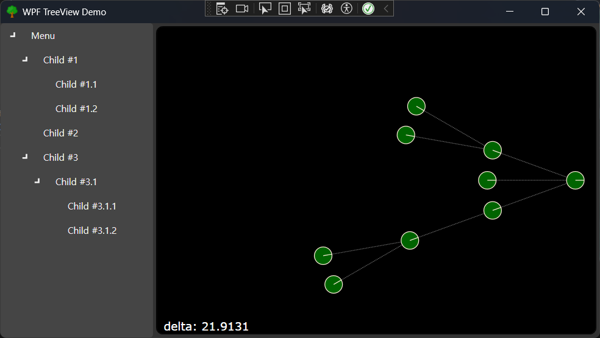

# WpfTreeViewDemo
[`MaterialDesign`](https://github.com/MaterialDesignInXAML/MaterialDesignInXamlToolkit) TreeView + TopologyView UserControl

<figure class="half">

</figure>

<a href="https://www.flaticon.com/kr/free-icons/" title="나무 아이콘">나무 아이콘 제작자: Freepik - Flaticon</a>

## License
This project is licensed under the MIT License - see the [LICENSE](LICENSE.txt) file for details.
